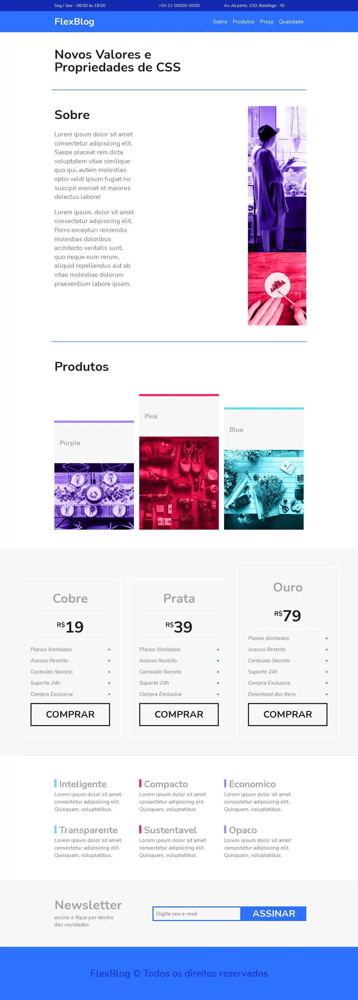

<h1 align="center" style="font-weight: bold;">FlexBlog</h1>

Este site foi desenvolvido com o objetivo principal de **praticar e entender a propriedade `display: flex` do CSS3**, uma das mais poderosas ferramentas de layout responsivo disponíveis na web moderna.

<h2 align="center"> Preview FlexBlog</h2>

    

<h2>📌 Sobre o Projeto</h2>

O projeto consiste em uma **página institucional fictícia** para uma empresa de design, contendo:

## 🔧 Estrutura do Site

- **Cabeçalho fixo** com menu de navegação alinhado horizontalmente (`flex-direction: row`) e distribuição de espaço entre os elementos (`justify-content: space-between`);
- Uma **seção principal com chamada de ação (hero)**, composta por texto e imagem dispostos lado a lado, utilizando `display: flex` para criar um layout em duas colunas adaptável a diferentes tamanhos de tela;
- Um **bloco de serviços** centralizado, com três colunas representando os serviços oferecidos. Cada item foi estruturado com `flex-direction: column` para alinhar ícones, títulos e descrições verticalmente;
- Uso de **media queries combinadas com `flex-wrap`** para garantir a responsividade em dispositivos móveis;
- Organização clara e moderna, com estética minimalista e cores suaves, facilitando a leitura e a navegação.

## 🎯 Objetivos de Aprendizado

Este projeto serviu como laboratório prático para aplicar conceitos como:

- `justify-content`, `align-items`, `flex-direction`, `gap` e `flex-wrap`;
- Criação de layouts modulares e reutilizáveis;
- Alinhamento de elementos em eixo principal e cruzado de forma intuitiva.

## 🧠 Considerações Finais

 Projeto feito com base no curso <strong>Origamid - Css Flexbox.</strong> Projeto feito para o meu próprio aprimoramento na programação, onde consegui evoluir minhas habilidades em CSS (Linguagem de estilização). Acesse o projeto clicando <a href="https://uhwdev.github.io/flexblog.github.io/">aqui</a>.
 